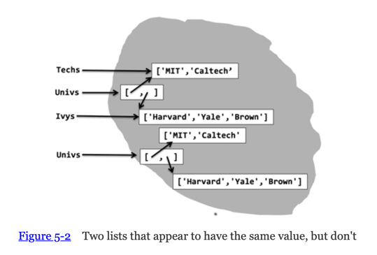
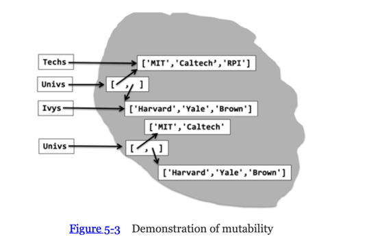
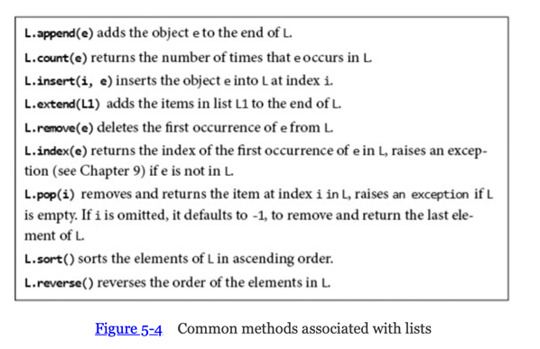
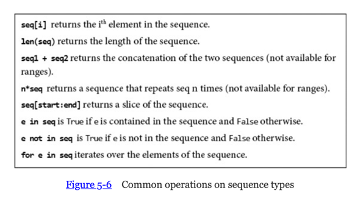
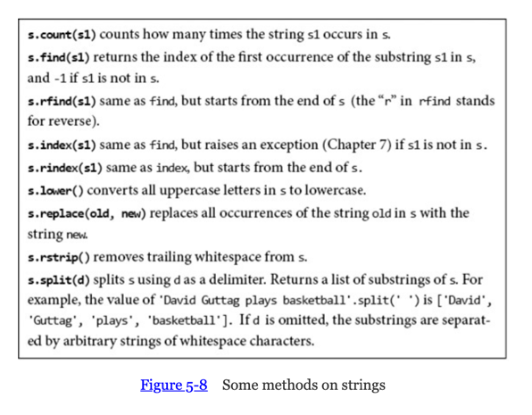
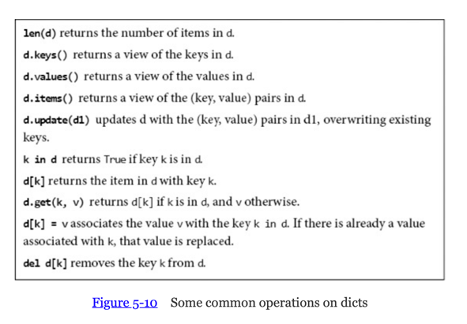

# 5. Structured types and mutability


## Tuples

Tuples are immutable ordered sequences og elements (like strings),each can be of any type, not need to be all the same type.
Literals of type tuple are written by enclosing a comma- separated list of elements within parentheses.
For example:

```Python
t1 = ()
t2 = (1, 'two', 3)
t3 = (1) # will print 1
t4 = (1,)
```

- `print(t3)` is a verbose way to write the integer 1, to denote the singleton tuple containing this value, we write `(1,)`
- Repetition can be use `3 * ('a', 2)` evaluates to `('a', 2, 'a', 2, 'a', 2)`
- Like strings, tuples can be concatenated, indexed, and sliced.
- Tuples can contain tuples.

A `for` statement can be used to iterate over the elements of a tuple.
And the `in` operator can be used to test if a tuple contains a specific value.

### Multiple Assignment

If you know the length of a sequence (e.g., a tuple or a string), it can be convenient to use Python's `multiple assignment` statement to extract the individual elements.
For example `x, y = (3, 4)`

## Ranges and Iterables

### Ranges
The function `range` produces an object of type `range`, a sequence of integers.
Like strings and tuples, objects of type range are `immutable`.
All the operations on tuples (except concatenation and repetition) are available for ranges :
- for example `range(10)[2:6][2]`
- `==` operator cans compare objects of type `range`, it returns `True` if two ranges represent the same sequence of integers. 
  - For example, `range(0, 7, 2) == range(0, 8, 2)` evaluates to True
  - `range(0, 7, 2) == range(6, -1, -2)` evaluates to False because order is different

The most common use of `range` if in `for` loops. In Python 3, `range`is a special case of an `iterable oject`

### Iterables
All iterables types have a method `__iter__` that returns an object of `type iterator` that can then be used in a for loop to return a sequence of objects, one at a time.
Python has many built-in iterable types, including strings, lists, and dictionaries.

Many useful built-in functions operate on iterables, e.g. 
- `sum`: can be applied to an iterable of numbers
- `min`, `max` : to iterables for which there is a well-defined ordering on the elements (e.g. alphabetic list)

[finger exercice](/code/finger_ex_5_2.py)

## Lists and Mutability

### Lists
Like a tuple, a `list` is an ordered sequence of values, where each value is identified by an `index`. We use square brackets rather than parentheses.
- [] is an empty list
- [,] is a singleton
- lists are iterables, we can use a for statement to iterate over the elements of the list.
- we can also index into lists and slice

Using square brackets for three different purposes :
1. literals of type list,
2. indexing into iterables,
3. slicing iterables,
can lead to visual confusion, like `[1,2,3,4][1:3][1]`. In practice, most of the time lists are built incrementally rather than written as literals.

### Mutability
Lists are `mutable` ! In contrast, tuples and strings are `immutable`.

> Objects of immutable types cannot be modified after they are created. On the other hand, objects of mutable types can be modified after they are created.

The distinction between mutating an object and assigning an object to a variable may, at first, appear subtle, but remember the mantra: 
> “In Python a variable is merely a name, i.e., a label that can be attached to an object,”



```python
Techs = ['MIT', 'Caltech'] #immutable
Ivys = ['Harvard', 'Yale', 'Brown'] #immutable
Univs = [Techs, Ivys]
Univs1 = [['MIT', 'Caltech'], ['Harvard', 'Yale', 'Brown']]
print('Univs =', Univs)
print('Univs1 =', Univs1)
print(Univs == Univs1) # Evaluates True but Univs and Univs1 are bound to quite different values. #test value equality

print(id(Univs) == id(Univs1)) #test object equality
print(Univs is Univs1) #test object equality
print('Id of Univs =', id(Univs))
print('Id of Univs1 =', id(Univs1))
```

Why the big fuss about the difference between value and object equality? It matters because lists are mutable.
If we change the list `Techs` with `Techs.append('RPI')`,the append method for lists has a `side effect`.
Rather than create a new list, it mutates the existing list, `Techs`, by adding a new element. 
Figure 5-3 depicts the state of the computation after `append` is executed.



`Univs` list still contains two lists, but the content of `Techs` list has change now.

What we have here is called `aliasing`. There are two distinct paths to the same list object:
- via `Univs[0]` list which first element is bound to `Techs`
- via variable `Techs`

This can be convenient, but it can also be treacherous.

[finger exercice](/code/finger_ex_5_3.py)


The interaction of aliasing and mutability with default parameter values is something to watch out for
```python
def append_val(val, list_1 = []):
    list_1.append(val)
    print(list_1)
append_val(3)
append_val(4)
```
It will print `[3, 4]` and not `[4]` because:
- at function definition time, a new object of type list is created, with an initial value of the empty list.
- Each time `append_val` is invoked without supplying a value for the formal parameter `list_1`, the object created at function definition is bound to `list_1, mutated, and then printed

If we want to add the elements of one list into another list. We can do that by using list concatenation (using the + operator) or the `extend` method, e.g.

```python
L1 = [1,2,3]
L2 = [4,5,6]
L3 = L1 + L2
print('L3 =', L3) # Print [1, 2, 3, 4, 5, 6]
L1.extend(L2)
print('L1 =', L1) # Print [1, 2, 3, 4, 5, 6]
L1.append(L2)
print('L1 =', L1) # Print [1, 2, 3, 4, 5, 6, [4, 5, 6]]
```

Notice that the operator `+` does not have a side effect. It creates a new list and returns it. In contrast, `extend` and `append each mutate L1.

### Methods associated with lists
Note that all of these except `count` and `index mutate the list.



## Cloning

It is usually prudent to avoid mutating a list over which one is iterating.
During a for loop, Python keeps track of where it is in the list using an internal counter that is incremented at the end of each iteration.
If the list is mutated, it can ignore an index like in the code example `remove_dups`.
To avoid this kind of problem:
- you can to use `slicing` to `clone` i.e. making a copy, writing `for e1 in L1[:]` 
- or copy method, the expression `L1.copy()` has the same value as `L1[:]`
Both slicing and copy perform what is known as a `shallow copy`, it creates a new list and insert the objects (not copies of the object) of the list to be copied.
```python
L1 = [1,2,3,4]
new_L1 = L1 # not a copy, introduce a new name for the existing list
for e1 in new_L1:
    print('e1')
```

If the list to be copied **contains mutable objects** that you also want to copy, import the standard library module `copy` and use the function `copy.deepcopy` to make a deep copy.

```python
import copy
L = [2]
L1 = [L]
L2 = L1[:]
L.append(3)
print(f'L1 = {L1}, L2 = {L2}')
# prints L1 = [[2, 3]] L2 = [[2, 3]] because both L1 and L2 contain the object that was bound to L in the first assignment statement.
```
Understanding `copy.deepcopy` is tricky if the elements of a list are lists containing lists (or any `mutable` type).

```python
import copy
L = [2]
L1 = [L]
L2 = copy.deepcopy(L1) # deepcopy creates a new list and then inserts copies of the objects in the list to be copied into the new list
L.append(3)
print(f'L1 = {L1}, L2 = {L2}')
# it will print L1 = [[2, 3]], L2 = [[2]], because L2 would not contain the object to which L is bound.
```

It makes copies all the way to the bottom—most of the time.
An attempt to make copies all the way to the bottom would never terminate in the code below
```python
L1 = [2]
L1.append(L1)
print('L1 =', L1)
```
To avoid this problem, `copy.deepcopy` makes **exactly one copy** of each object, and then uses that copy for each instance of the object.

```python
import copy
L1 = [2]
L2 = [L1, L1] # Prints [[2], [2]]
L3 = copy.deepcopy(L2) # copy.deepcopy makes one copy of L1 and uses it both times L1 occurs in L2
L3[0].append(3) # Mutate L1, becomes [2,3]
print(L3)
print(L2) # Prints [[2, 3], [2, 3]]
```


## List comprehension

`List comprehension provides a concise way to apply an operation to the sequence values provided by iterating over an iterable value:
- it creates a new list
- is an expression of the form `[expr for elem in iterable if test]`
- it provides a convenient way to initialize lists
  - `[[] for _ in range(10)]` generates a list containing 10 distinct (i.e., non-aliased) empty lists. The variable name `_` indicates that the values of that variable are not used in generating the elements of list, i.e., it is merely a `placeholder`.

### Nested lists
Python allows multiple `for` statements within a list comprehension
```python
print([[(x,y) for x in range(6) if x%2 == 0]
       for y in range(6) if y%3 == 0])
```

> Some Python programmers use list comprehensions in marvelous and subtle ways. That is not always a great idea. Remember that somebody else may need to read your code, and “subtle” is rarely a desirable property for a program.

## Higher-Order Operations on Lists

In chapter 4, we see that a function is called `higher-order` because it has an argument that is itself a function.

### Map

Python's built-in function similar to `apply_to_each` in [chapter_5_code](/code/chap_5_code.py), often used with a `for`loop.
Takes a `unary` function (i.e., a function that has only one parameter) as first argument in its simpliest and the second any ordered collection of values suitables as argument to the function.
`list(map(str, range(10)))` is equivalent to `[str(e) for e in range(10)]`

First argument can be a function with `n` arguments, in which case it must be followed by n subsequent ordered collections:
```python
L1 = [1, 28, 36]
L2 = [2, 57, 9]
for i in map(min, L1, L2):
    print(i)
```

## Strings, Tuples, Ranges, and Lists

| Type  | Type of elements |      Examples of literals | Mutable |
|:------|:----------------:|--------------------------:|--------:|
| str   |    characters    |            '', 'a', 'abc' |      No |
| tuple |     any type     |      (), (3,), ('abc', 4) |      No |
| range |     integers     | range(10), range(1, 10,2) |      No |
| list  |     any type     |       [], [3], ['abc', 4] |     Yes |
Comparison of sequence types



Python programmers tend to use lists far more often than tuples, since lists are mutable, they can be constructed incrementally during computation.
```python
L = range(0, 10)
even_elems = []
for e in L:
    if e%2 == 0:
        even_elems.append(e)
```

Strinss can contain only characters, they are less versatile than tuples or lists, but they have many useful built-in methods.
Since strings are *immutable*, these all return values and have no *side effects*.



One of the more useful is `split`, the second argument specifies the separator that is used to split the first argument into a `sequence of `substrings`. 
It can be optionnal and if omitted, the first string is split using arbitrary strings of whitespace characters (space, tab, newline, return, and formfeed)
Since Python strings support Unicode, the complete list of whitespace characters is much longer (see https://en.wikipedia.org/wiki/Whitespace_character).

```python
print('My favorite professor–John G.–rocks'.split(' '))
print('My favorite professor–John G.–rocks'.split('-'))
print('My favorite professor–John G.–rocks'.split())
```

## Sets

`Sets` are similar to the notion of a set in mathematics in that they are `unordered` collections of `unique` elements.
They are denoted using what programmers call curly braces and mathematicians call set braces, e.g.,
Example: `baseball_teams = {'Dodgers', 'Giants', 'Padres', 'Rockies'}`

- Unordered so attempting to index into a set, e.g., evaluating `baseball_teams[0]`, generates a runtime error
- We can use a `for` statement to iterate over the elements of a set (the order in which the elements are produced is undefined)
- Sets are mutable
  - We add a single element to a set using the `add` method
  - We add multiple elements to a set by passing a collection of elements (e.g., a list) to the `update` method
  - Elements can be removed from a set using the `remove` method, which raises an error if the element is not in the set or the `discard` method, which does not raise an error if the element is not in the set

```python
baseball_teams = {'Rockies'}
football_teams = {}
baseball_teams.add('Yankees')
football_teams.update(['Patriots', 'Jets'])
football_teams.remove('Patriots')
```

Membership in a set can be tested using the in operator. 
For example, `'Rockies' in baseball_teams` returns True. 
The binary methods `union`, `intersection`, `difference`, and `issubset` have their usual mathematical meanings.
There are convenient infix operators for many of the methods, including `|` for `union`, `&` for `intersect`, `-` for `difference`, `<=` for `subset`, and `>= `for `superset`.

```python
baseball_teams = {'Dodgers', 'Giants', 'Padres', 'Rockies'}
football_teams = {'Giants', 'Eagles', 'Cardinals', 'Cowboys'}
print(baseball_teams.union({1, 2}))
print(baseball_teams | {1, 2}) # infix operator for union
print(baseball_teams.intersection(football_teams))
print(baseball_teams.difference(football_teams))
print({'Padres', 'Yankees'}.issubset(baseball_teams))
```

### Hashable
Not all types of objects can be elements of sets. All objects in a set must be `hashable` :
- A `__hash__` method that maps the object of the type to an `int`, and the value returned by `__hash_`_ does not change during the lifetime of the object, and
- An `__eq__` method that is used to compare it for equality to other objects.

- All objects of Python's scalar immutable types are hashable, and no object of Python's built-in mutable types is hashable. 
- An object of a non-scalar immutable type (e.g., a tuple) is hashable if all of its elements are hashable.

## Dictionaries

Objects of type `dict` (short for dictionary) are like `lists` except that we index them using `keys` rather than integers.
Any hashable object can be used as a key.
Think of a dictionary as a set of key/value pairs.
```python
  month_numbers = {'Jan':1, 'Feb':2, 'Mar':3, 'Apr':4,'May':5,  1:'Jan', 2:'Feb', 3:'Mar', 4:'Apr', 5:'May'}
  print('The third month is ' + month_numbers[3])
```
The entries in a dict cannot be accessed using an index, `month_numbers[1]` unambiguously refers to the entry with the `key` 1 rather than the second entry. 

Whether a key is defined in a dictionary can be tested using the `in` operator.
Like lists, dictionaries are **mutable**, we can:
- add an entry by writing, for example, `month_numbers['June'] = 6 `
- change an entry by writing, for example, `month_numbers['May'] = 'V'`.

Some common operations on dicts:
